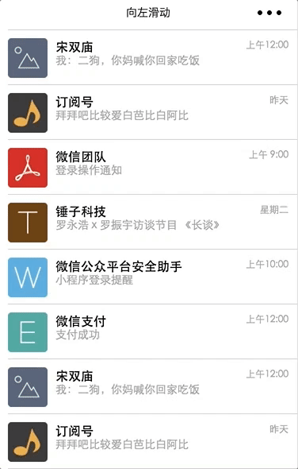

# wechat-app-LeftSlide
微信小程序仿微信， QQ 向左滑动删除操作。


## 废话不多说， 先看效果， 能满足您的需求， 您在接着往下看。




    本人比较懒， 删除动作有点太生硬， 实在看不惯的同学可以加个动画上去。
   
### OK 下面来看代码

#### 首先是 wxml 里面绑定事件 
    
 ``` html
   <view class="item-wrapper">
    <view class="item-list" wx:for="{{itemData}}" wx:for-item="item" wx:for-index="index" wx:key="that">
        <view class="item-info" data-index="{{index}}" bindtouchstart="touchS" bindtouchmove="touchM" bindtouchend="touchE" style="left:{{item.left + 'rpx'}}">
            <image class="info-img" src="{{item.img}}"></image>
            <view class="info-wrapper">
                <view class="info-desc">
                    <view class="name">{{item.name}}</view>
                    <view class="time">{{item.time}}</view>
                </view>
                <view class="info-content">{{item.info}}</view>
            </view>
        </view>
        <view class="item-oper">
            <view class="oper-delete" bindtap="itemDelete" data-index="{{index}}">删除</view>
        </view>
    </view>
</view>
```

    主要就是用的小程序的 touch 事件来进行处理

    样式就不说了， 可以自己写， 不想写的同学也可以拿来直接用。
    
#### 然后就是事件的处理函数了

``` javascript
touchS: function (e) {  // touchstart
    let startX = App.Touches.getClientX(e)
    startX && this.setData({ startX })
  },
  touchM: function (e) {  // touchmove
    let itemData = App.Touches.touchM(e, this.data.itemData, this.data.startX)
    itemData && this.setData({ itemData })

  },
  touchE: function (e) {  // touchend
    const width = 150  // 定义操作列表宽度
    let itemData = App.Touches.touchE(e, this.data.itemData, this.data.startX, width)
    itemData && this.setData({ itemData })
  },
  itemDelete: function(e){  // itemDelete
    let itemData = App.Touches.deleteItem(e, this.data.itemData)
    itemData && this.setData({ itemData })
  },
  ```
  
    事件函数主演也是 touch 的三个事件还有删除事件， 每个事件的核心是更新数据， 也就是 setData()
    
#### 数据处理函数

    数据处理的函数我单独拿了出来， 这样有利于复用。 放在 utils 文件夹下的 Touches.js 文件里面
    
``` javascript
touchM(e, dataList, startX) {  // touchmove 过程中更新列表数据
        let list = this._resetData(dataList)
        list[this._getIndex(e)].left = this._getMoveX(e, startX)
        return list
    }

    touchE(e, dataList, startX, width) {  // touchend 更新列表数据
        let list = this._resetData(dataList)
        let disX = this._getEndX(e, startX)
        let left = 0

        if (disX < 0) {  // 判断滑动方向， （向左滑动）
            // 滑动的距离大于删除宽度的一半就显示操作列表 否则不显示
            Math.abs(disX) > width / 2 ? left = -width : left = 0
        } else {  // 向右滑动复位
            left = 0
        }

        list[this._getIndex(e)].left = left
        return list
    }

    deleteItem(e, dataList) {  // 删除功能
        dataList.splice(this._getIndex(e), 1)
        return dataList
    }
```

    每个函数都有注释说明， 相信都能看得懂， 就不多解释了。 
    
    有什么更好的方法， 或建议欢迎提出。 感觉本轮子还可以欢迎 Star 。
